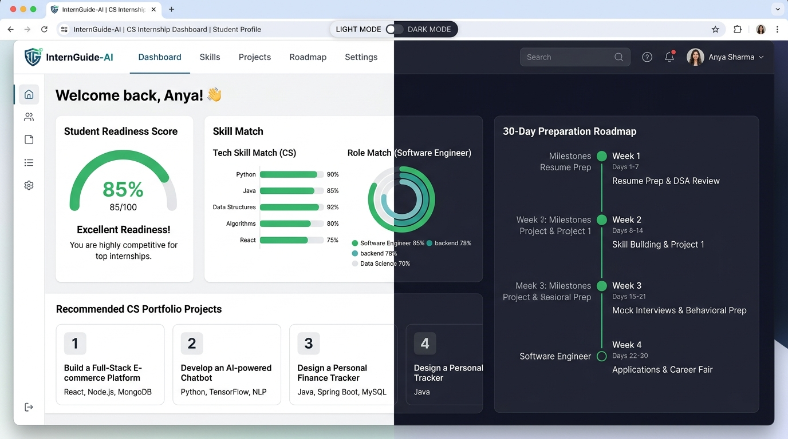
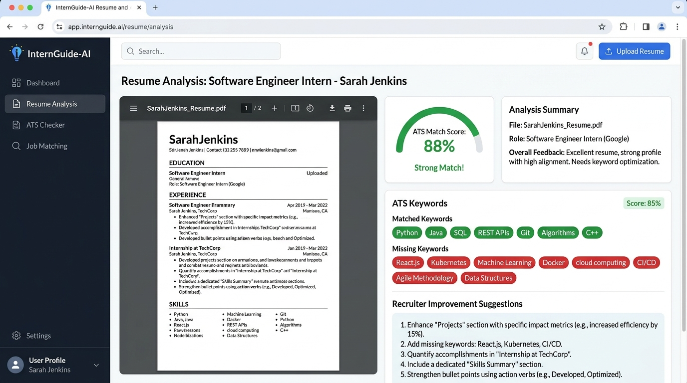
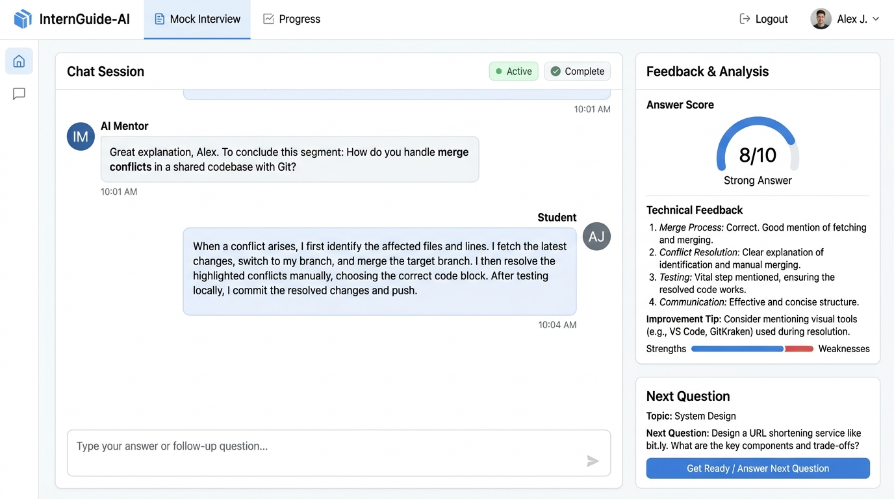

# InternGuide-AI 🚀
> **AI-Powered Internship Preparation & Mentorship Assistant for Computer Science Students**

[](https://internprepai.vercel.app)
[](https://ai.google.dev/)
[](https://www.typescriptlang.org/)

---

## 🌟 Live Application
🔗 **Click here to view the live app:** [https://internprepai.vercel.app](https://internprepai.vercel.app)

---

## 📌 Problem Statement & Target Audience

### **Target Audience**
Undergraduate and graduate students studying **Computer Science, Software Engineering, Information Technology, Data Science, Artificial Intelligence, and Cybersecurity** who are actively seeking entry-level software engineering or tech internships.

### **The Real Problem It Solves**
Every semester, thousands of Computer Science students apply for tech internships without knowing if their academic coursework, technical stack, or project experience meet actual industry standards. 
- **Generic AI Chatbots** provide high-level, generic advice lacking CS domain specificity.
- **Traditional ATS Scanners** only count superficial keywords without evaluating quantified metrics, project complexity, or technical impact.
- **Lack of Structured Guidance:** Students often do not know which specific skills to learn next, what portfolio projects to build, or how to prepare for recruiter technical and behavioral interviews within a 30-day preparation window.

### **The Solution: InternGuide-AI**
**InternGuide-AI** acts as a virtual CS Industry Mentor and Tech Recruiter. It evaluates student profiles against entry-level job standards, parses PDF resumes for ATS friendliness and bullet point impact, pinpoints missing skill gaps with prioritized learning resources, generates a custom 30-day (4-week) preparation roadmap, and provides an interactive mock recruiter interview simulator.

---

## ✨ Features List

- 🎓 **Student Profile & Assessment Engine**:
  - Captures academic semester (Sem 1 to 8 / Graduate), degree, technical skills, experience level, and target career role (e.g. Full-Stack, AI/ML, Backend, DevOps, Cybersecurity).
  - Includes preset student profiles (e.g., Sarah Chen, Alex Rivera, Priyah Sharma) for 1-click testing.
- 📊 **AI Readiness Dashboard**:
  - Calculates an overall Internship Readiness Score (0–100), technical skill match percentage, project strength rating, and missing skill alerts.
  - Suggests 2 custom, highly relevant portfolio projects complete with concrete technical deliverables.
- 📄 **AI Resume & ATS Analyzer**:
  - Accepts PDF file uploads and raw text pasting.
  - Multi-stage PDF extraction pipeline (`pdf-parse`, custom page-renderers, `zlib` stream decompression, and direct Gemini multimodal PDF processing).
  - Evaluates ATS compatibility score, impact action verbs, quantified metrics, section formatting, and provides actionable bullet-point rewrite suggestions.
- 🎯 **Prioritized Skill Gap Analysis**:
  - Categorizes missing skills into High Priority (Must-Have), Medium Priority (Should-Have), and Low Priority (Nice-to-Have).
  - Estimates learning hours/weeks required and provides direct curated learning resources (MDN, freeCodeCamp, Kaggle, Official Docs).
- 📅 **30-Day Preparation Roadmap**:
  - Generates a structured 4-week preparation plan (Week 1: Core Architecture, Week 2: Portfolio Project, Week 3: ATS Resume & System Design, Week 4: Technical & Behavioral Drills).
  - Interactive week-by-week checklist with actionable milestone tracking.
- 💬 **Interactive Mock Recruiter Interview Simulator**:
  - Real-time conversational practice with InternGuide-AI Mentor.
  - Evaluates student answers on clarity, technical accuracy, and STAR-method structure.
  - Gives instant scores (out of 10) and feedback before asking follow-up questions tailored to the student's target role.
- 📑 **Exportable Preparation Report**:
  - Generates and downloads a comprehensive text/PDF preparation report containing readiness scores, skill gap breakdowns, resume advice, and roadmap details for offline reference.
- 🌓 **Modern UI with Dark/Light Mode**:
  - Responsive, desktop-and-mobile optimized layout with theme toggle, smooth transitions, and accessible UI controls.

---

## 📸 Screenshots of the App in Action

### 1. AI Readiness Dashboard & Student Profile Analysis


### 2. AI Resume & ATS Analyzer


### 3. Interactive Mock Interview Practice


---

## 🤖 AI Feature & System Prompts

**InternGuide-AI** is powered by **Google Gemini 3.6 Flash (`gemini-3.6-flash`)** using the official `@google/genai` SDK. All AI calls run securely on the server side (`/api/*`) to safeguard API keys and process unstructured text/PDF inputs.

### **System Prompts Behind the AI Engine**

#### **1. Profile Readiness Evaluator (`/api/analyze-profile`)**
```ts
const systemInstruction = `You are InternGuide-AI Mentor, an experienced Computer Science internship recruiter and industry mentor.
Analyze the student's academic profile, current skills, semester, experience level, and target career goal.
Evaluate their internship readiness strictly and constructively without exaggerating.
Provide an honest score (0 to 100), identify strengths, weaknesses, missing skills for their target role, recommended tech stack, 2 realistic portfolio projects with detailed deliverables, and actionable learning advice.`;
```

#### **2. Resume & ATS Analyzer (`/api/analyze-resume`)**
```ts
const systemInstruction = `You are InternGuide-AI Mentor, reviewing a Computer Science student's resume as an experienced internship recruiter.
Evaluate the resume for overall quality, ATS (Applicant Tracking System) friendliness, content clarity, bullet point impact (Action verbs, metrics), key missing sections/skills, and specific improvement suggestions.
Provide a resume score (0-100), ATS score (0-100), strengths, weaknesses, missing information, detailed improvement suggestions, and keyword analysis.`;
```

#### **3. Skill Gap Priority Analyzer (`/api/analyze-skill-gap`)**
```ts
const systemInstruction = `You are InternGuide-AI Mentor. Compare the student's current skills against standard industry expectations for entry-level internships in ${profile.careerGoal}.
Categorize missing/gap skills into High Priority (Must Have), Medium Priority (Should Have), and Low Priority (Nice to Have).
Provide learning difficulty, estimated time required in hours/weeks, and top 2 free reputable learning resources with valid titles and helpful descriptions.`;
```

#### **4. 30-Day Roadmap Generator (`/api/generate-roadmap`)**
```ts
const systemInstruction = `You are InternGuide-AI Mentor. Generate a highly structured, realistic 30-day (4-week) internship preparation roadmap tailored specifically to this CS student.
The roadmap must cover Weeks 1, 2, 3, and 4 sequentially.
Each week must include:
- Week Title & Focus Area
- Description
- Key Action Items (Milestones)
- Target Outcome`;
```

#### **5. Recruiter Mock Interview Simulator (`/api/mock-interview`)**
```ts
const systemInstruction = `You are InternGuide-AI Mentor, conducting a mock technical & behavioral internship interview with a CS student named ${profile?.name}.
Target Role: ${profile?.careerGoal}
Degree/Semester: ${profile?.degree} (${profile?.semester})
Current Known Skills: ${profile?.currentSkills.join(', ')}

Evaluate the student's response for clarity, correctness, technical depth, and STAR method. Provide feedback, a rating out of 10, and ask the next logical follow-up question.`;
```

---

## 🛠️ Tools, Services, & Tech Stack

| Category | Technology / Service Used |
| :--- | :--- |
| **AI Model & SDK** | Google Gemini 3.6 Flash (`gemini-3.6-flash`), `@google/genai` |
| **Frontend Framework** | React 18, Vite, TypeScript |
| **Styling & Icons** | Tailwind CSS, Lucide React Icons |
| **Backend Runtime** | Node.js, Express, TypeScript (`tsx` dev server, `esbuild` CJS production bundle) |
| **File Handling** | Multer (In-Memory Buffer), `pdf-parse`, `zlib` stream decompression |
| **Deployment** | Render (`https://render.com`) / Vercel / Cloud Run Containers |

---

## 🚀 Deploying to Render

This full-stack application includes a custom Express backend and Vite frontend built into a bundled production package ready for Render Web Services.

### **Option 1: Deploy with `render.yaml` (Blueprint)**
1. Connect your GitHub / GitLab repository to **Render**.
2. Select **New +** -> **Blueprint**.
3. Select your repository. Render will automatically read `/render.yaml` and configure the Web Service with:
   - **Environment:** Node
   - **Build Command:** `npm run build`
   - **Start Command:** `npm run start`
4. In the Render Dashboard, set your environment variable:
   - `GEMINI_API_KEY`: Your Google Gemini API Key

### **Option 2: Manual Web Service Setup**
1. Click **New +** -> **Web Service** on Render.
2. Connect your project repository.
3. Configure the following fields:
   - **Environment:** Node
   - **Build Command:** `npm run build`
   - **Start Command:** `npm run start`
4. Under **Environment Variables**, add:
   - `GEMINI_API_KEY`: `your_google_gemini_api_key_here`
5. Click **Create Web Service**. Render will automatically build the static assets, bundle the Express server, and start listening on Render's assigned port.

---

## 💻 How to Run the Project Locally

### **Prerequisites**
- Node.js (v18 or higher)
- npm or yarn
- Google Gemini API Key (obtain from [Google AI Studio](https://aistudio.google.com/))

### **Step 1: Clone the Repository**
```bash
git clone https://github.com/your-username/internguide-ai.git
cd internguide-ai
```

### **Step 2: Install Dependencies**
```bash
npm install
```

### **Step 3: Set Up Environment Variables**
Create a `.env` file in the project root directory (refer to `.env.example`):
```env
GEMINI_API_KEY=your_google_gemini_api_key_here
PORT=3000
```

### **Step 4: Start the Development Server**
```bash
npm run dev
```
The application will start on `http://localhost:3000`. Open your browser to view and interact with the app.

### **Step 5: Build and Run for Production**
```bash
npm run build
npm run start
```

---

## 📜 License
This project is open-source and built for Computer Science students worldwide to bridge the gap between university coursework and tech industry internships.
