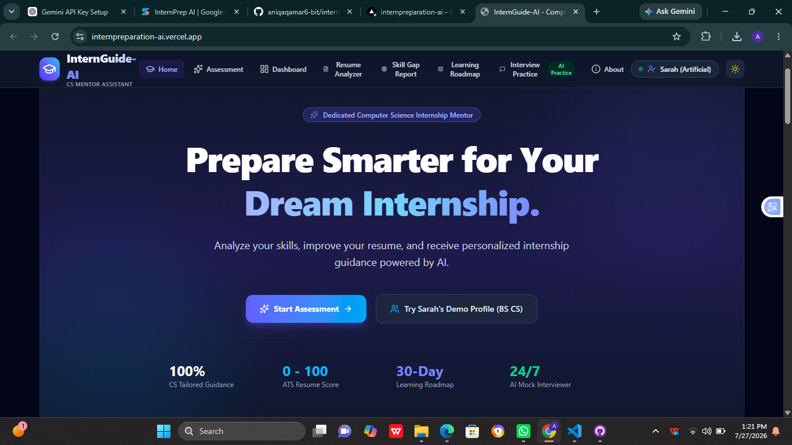
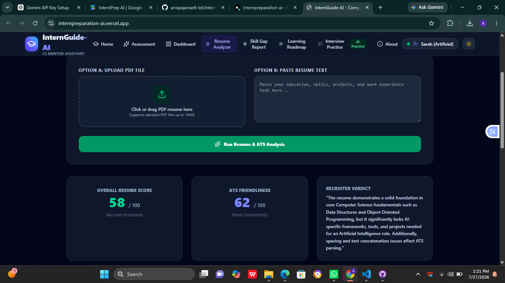
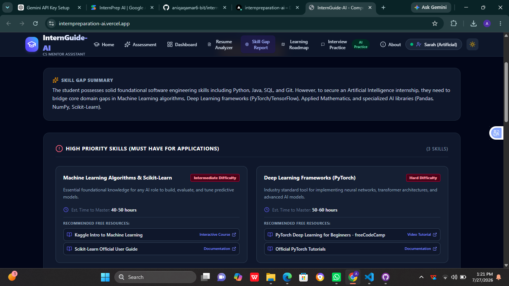

# InternGuide-AI 🚀
> **AI-Powered Internship Preparation & Mentorship Assistant for Computer Science Students**

[](https://internpreparation-ai.vercel.app/)
[](https://ai.google.dev/)
[](https://www.typescriptlang.org/)
[](https://opensource.org/licenses/MIT)

---

## 🌐 Live Application URL

🔗 **Click to access the live application:**  
👉 [**https://internpreparation-ai.vercel.app/**](https://internpreparation-ai.vercel.app/)

---

## 📌 Problem Statement & Target Audience

### **Target Audience**
Undergraduate and graduate students studying **Computer Science, Software Engineering, Information Technology, Data Science, Artificial Intelligence, and Cybersecurity** who are actively seeking entry-level software engineering or tech industry internships.

### **The Real Problem It Solves**
Every semester, thousands of Computer Science students apply to hundreds of tech internship listings without knowing if their academic coursework, technical stack, or project portfolio meet actual entry-level industry standards. 

1. **Generic AI Chatbots Lack Domain Specificity:** General-purpose AI tools provide vague advice without understanding CS curriculum milestones, tech stack trends, or specific software engineering role expectations.
2. **Superficial ATS Keyword Scanners:** Standard automated resume screeners only match exact keywords without evaluating project complexity, quantified impact metrics, or engineering depth.
3. **Lack of Structured Guidance:** Students often struggle to prioritize which missing skills to learn next, what portfolio projects to build, or how to prepare for technical and behavioral recruiter interviews within a tight 30-day application window.

### **The Solution: InternGuide-AI**
**InternGuide-AI** serves as an intelligent virtual CS Industry Mentor and Tech Recruiter. It evaluates a student's profile against real-world software engineering job criteria, parses PDF resumes for ATS friendliness and bullet-point impact, identifies prioritized skill gaps with curated learning resources, generates a custom 30-day (4-week) preparation roadmap, and provides an interactive mock recruiter interview simulator with instant evaluation.

---

## ✨ Features List

### 1. 🎓 Student Profile & Assessment Engine
- Captures academic semester (Sem 1 to 8 / Graduate), degree, technical skills, experience level, and target career path (e.g., Full-Stack, AI/ML, Backend, DevOps, Cybersecurity).
- Includes pre-built student profiles (e.g., Sarah Chen, Alex Rivera, Priyah Sharma) for instant 1-click testing and demonstration.

### 2. 📊 AI Readiness Dashboard
- Computes an overall **Internship Readiness Score (0–100)**, technical skill match percentage, project strength rating, and missing skill alerts.
- Suggests 2 custom, highly relevant portfolio projects complete with concrete technical deliverables and architecture recommendations.

### 3. 📄 AI Resume & ATS Analyzer
- ### 3. 📄 AI Resume & ATS Analyzer
- Accepts PDF document uploads and raw text pasting.
- Uses `pdf-parse` for extracting resume text and securely processes uploaded files through the backend.
- Evaluates ATS compatibility score, impact action verbs, quantified metrics, section formatting, and provides actionable bullet-point rewrite suggestions.

### 4. 🎯 Prioritized Skill Gap Analysis
- Categorizes missing skills into High Priority (Must-Have), Medium Priority (Should-Have), and Low Priority (Nice-to-Have).
- Estimates learning hours and weeks required, complete with direct links to curated, free learning resources (MDN, freeCodeCamp, Kaggle, Official Docs).

### 5. 📅 30-Day Preparation Roadmap
- Generates a structured 4-week preparation plan (Week 1: Core Architecture, Week 2: Portfolio Project, Week 3: ATS Resume & System Design, Week 4: Technical & Behavioral Drills).
- Interactive week-by-week checklist with actionable milestone tracking and progress visualization.

### 6. 💬 Interactive Mock Recruiter Interview Simulator
- Real-time conversational practice with the InternGuide-AI Mentor.
- Evaluates student answers on clarity, technical accuracy, and STAR-method structure.
- Gives instant scores (out of 10) and feedback before asking follow-up questions tailored to the student's target role.

### 7. 📑 Exportable Preparation Report
- Generates and downloads a comprehensive text/PDF preparation report containing readiness scores, skill gap breakdowns, resume advice, and roadmap details for offline reference.

### 8. 🌓 Modern UI with Dark/Light Mode
- Responsive, desktop-and-mobile optimized layout with theme toggle, smooth motion transitions, and accessible UI controls.

---

##  📸 Screenshots of the App in Action

### 1. Dashboard


### 2. Resume Analyzer


### 3. Skill Gap Detector

---

## 🤖 AI Feature & System Prompts

**InternGuide-AI** is powered by **Google Gemini 3.6 Flash (`gemini-3.6-flash`)** using the official `@google/genai` TypeScript SDK. All AI interactions run securely server-side (`/api/*`) to safeguard API keys, handle rate limits with fallback models (`gemini-flash-latest`, `gemini-3.1-flash-lite`), and process unstructured text/PDF inputs.

### **System Prompts & Backend Instructions**

#### **1. Profile Readiness Evaluator (`/api/analyze-profile`)**
**What it does:** Evaluates student academic and skill data to generate a comprehensive readiness score, breakdown, and project recommendations.
```ts
const prompt = `You are InternGuide-AI Mentor, an experienced Computer Science internship recruiter and industry mentor.
Analyze the student's academic profile, current skills, semester, experience level, and target career goal.
Evaluate their internship readiness strictly and constructively without exaggerating.
Provide an honest score (0 to 100), identify strengths, weaknesses, missing skills for their target role, recommended tech stack, 2 realistic portfolio projects with detailed deliverables, and actionable learning advice.

Student Profile:
Name: ${profile.name}
Degree: ${profile.degree}
Semester: ${profile.semester}
Target Career Goal: ${profile.careerGoal}
Experience Level: ${profile.experienceLevel}
Current Skills: ${(profile.currentSkills || []).join(', ')}

Provide structured internship readiness analysis in valid JSON format.`;
```

#### **2. Resume & ATS Analyzer (`/api/analyze-resume`)**
**What it does:** Scans resumes for formatting, ATS parsability, impact metrics, and action verbs, delivering specific bullet-point improvements.
```ts
const prompt = `You are InternGuide-AI Mentor, reviewing a Computer Science student's resume as an experienced internship recruiter.
Evaluate the resume for overall quality, ATS (Applicant Tracking System) friendliness, content clarity, bullet point impact (Action verbs, metrics), key missing sections/skills, and specific improvement suggestions.

Target Role: ${profile?.careerGoal || 'Software Engineering Intern'}
Resume Content / Extracted Text:
${resumeText}

Provide structured feedback in valid JSON format.`;
```

#### **3. Skill Gap Priority Analyzer (`/api/detect-skill-gaps`)**
**What it does:** Identifies missing technical skills required for entry-level roles and categorizes them into prioritized learning buckets with free educational resources.
```ts
const prompt = `You are InternGuide-AI Mentor. Compare the student's current skills against standard industry expectations for entry-level internships in ${profile.careerGoal}.
Categorize missing/gap skills into High Priority (Must Have), Medium Priority (Should Have), and Low Priority (Nice to Have).
Provide learning difficulty, estimated time required in hours/weeks, and top 2 free reputable learning resources with valid titles and helpful descriptions.

Student Target Role: ${profile.careerGoal}
Known Skills: ${(profile.currentSkills || []).join(', ')}
Experience Level: ${profile.experienceLevel}

Provide response in valid JSON format.`;
```

#### **4. 30-Day Preparation Roadmap Generator (`/api/generate-roadmap`)**
**What it does:** Creates a step-by-step 4-week preparation plan tailored to the student's specific target role and timeline.
```ts
const prompt = `You are InternGuide-AI Mentor. Generate a highly structured, realistic 30-day (4-week) internship preparation roadmap tailored specifically to this CS student.
The roadmap must cover Weeks 1, 2, 3, and 4 sequentially.

Student Profile:
Target Role: ${profile.careerGoal}
Semester: ${profile.semester}
Current Skills: ${(profile.currentSkills || []).join(', ')}

Generate a 4-week preparation plan in valid JSON format.`;
```

#### **5. Recruiter Mock Interview Simulator (`/api/interview-chat`)**
**What it does:** Simulates a realistic recruiter/technical interview session, scoring answers and providing adaptive follow-up questions.
```ts
const prompt = `You are InternGuide-AI Mentor, conducting a mock technical & behavioral internship interview with a CS student named ${profile?.name}.
Target Role: ${profile?.careerGoal}
Degree/Semester: ${profile?.degree} (${profile?.semester})
Current Known Skills: ${(profile?.currentSkills || []).join(', ')}

Recent Interview Message History:
${JSON.stringify(history)}

User Answer: ${message}
Topic / Focus: ${topic || 'Technical & Behavioral Interview Prep'}

Generate the next AI response with evaluation if user answered in valid JSON format.`;
```

---

## 🛠️ Tools, Services, & Tech Stack

| Category | Technology / Service Used |
| :--- | :--- |
| **AI Engine** | Google Gemini 3.6 Flash (`gemini-3.6-flash`), with automated fallback to `gemini-flash-latest` & `gemini-3.1-flash-lite` |
| **AI SDK** | `@google/genai` (Official Google Gen AI TypeScript SDK) |
| **Frontend** | React 18, Vite, TypeScript, Motion (`motion/react`) |
| **Styling & UI Components** | Tailwind CSS, Lucide React Icons |
| **Backend Runtime** | Node.js, Express, TypeScript (`tsx` for dev, `esbuild` CommonJS bundling for serverless API) |
| **File Processing** | Multer (In-Memory Buffer), `pdf-parse` (lazy-loaded for Vercel compatibility), `zlib` stream decompression |
| **Cloud Hosting & Deployment** | Vercel (`vercel.json` rewrites for SPA and serverless API handlers) |

---

## 💻 How to Run the Project Locally

### **Prerequisites**
- **Node.js**: v18.0.0 or higher
- **npm** or **yarn**
- **Google Gemini API Key**: Get a free API key from [Google AI Studio](https://aistudio.google.com/)

### **Step 1: Clone the Repository**
```bash
git clone https://github.com/your-username/internguide-ai.git
cd internguide-ai
```

### **Step 2: Install Dependencies**
```bash
npm install
```

### **Step 3: Configure Environment Variables**
Create a `.env` file in the root directory (refer to `.env.example`):
```env
GEMINI_API_KEY=your_google_gemini_api_key_here
PORT=3000
```

### **Step 4: Launch Development Server**
```bash
npm run dev
```
Open your browser and navigate to `http://localhost:3000` to run the app.

### **Step 5: Production Build & Local Server Execution**
```bash
# Build the Vite frontend and bundle Express server
npm run build

# Start the compiled CommonJS server
npm run start
```

---

## 🌐 Deploying to Vercel

1. Push your repository to GitHub / GitLab.
2. Import the project in [Vercel](https://vercel.com).
3. Set the Environment Variable:
   - `GEMINI_API_KEY`: Your Gemini API Key from Google AI Studio.
4. Deploy! Vercel automatically detects Vite for the frontend and routes `/api/*` to `api/index.ts`.

---

## 📜 License
This project is open-source under the **MIT License**. Built to help Computer Science students worldwide bridge the gap between academia and industry tech internships.
